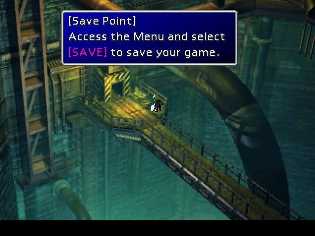
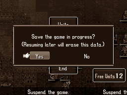
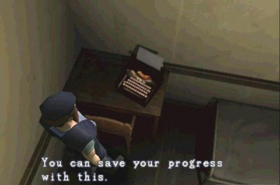
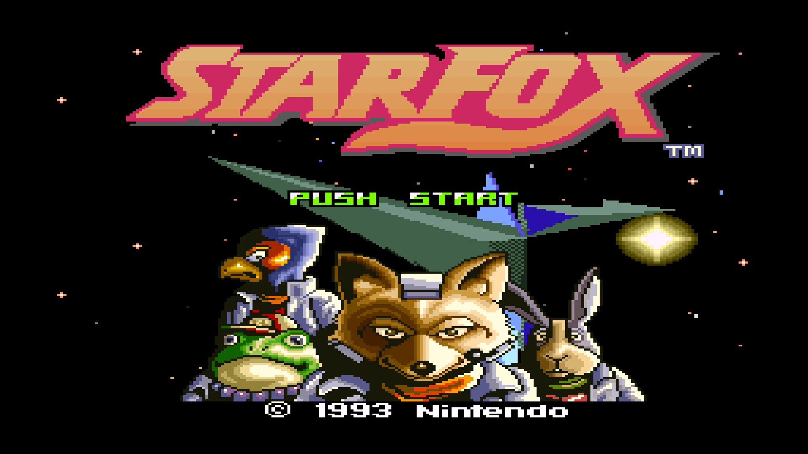
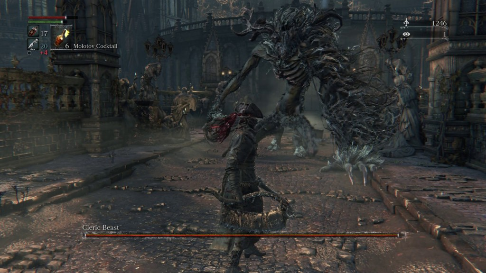
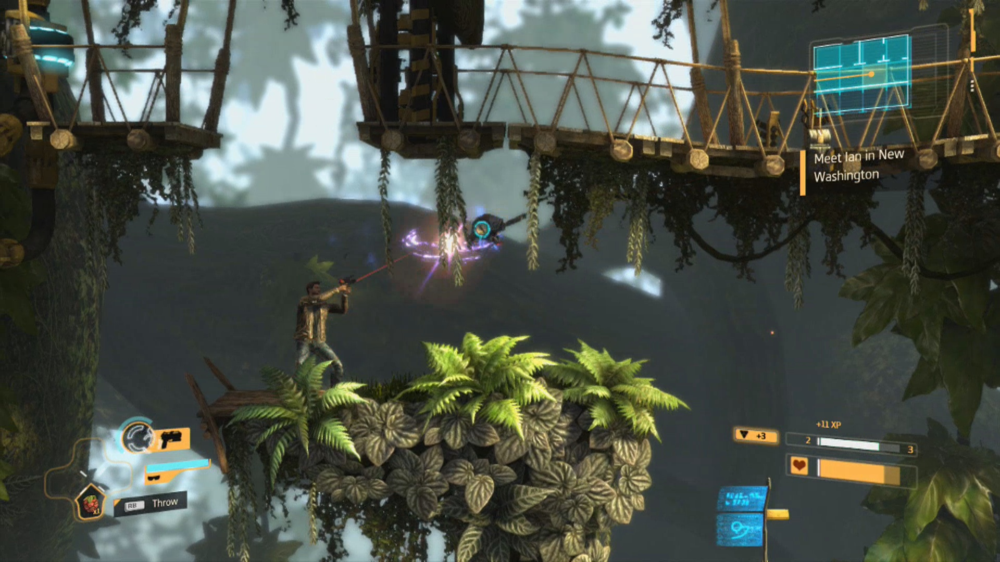
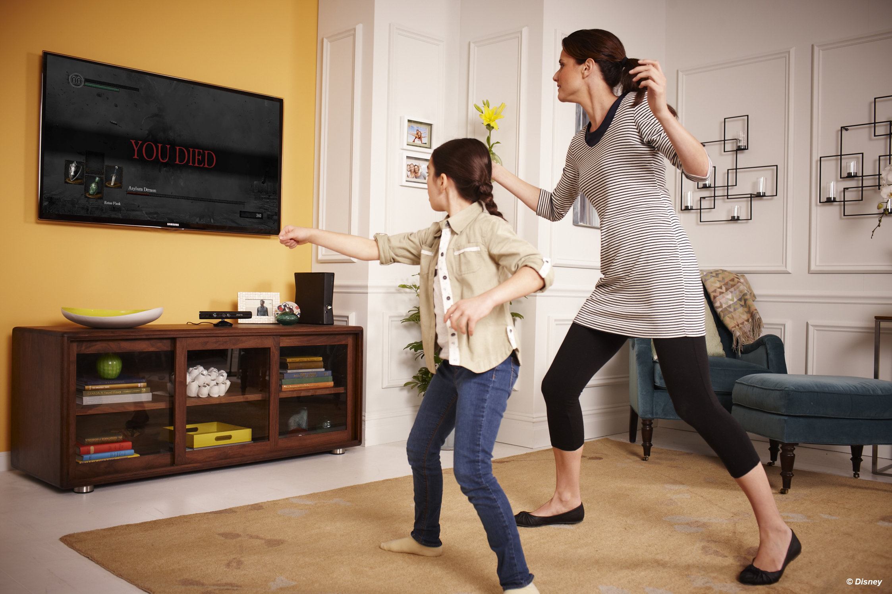
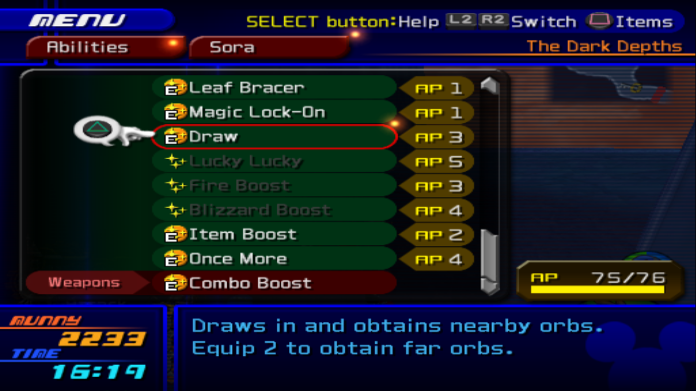
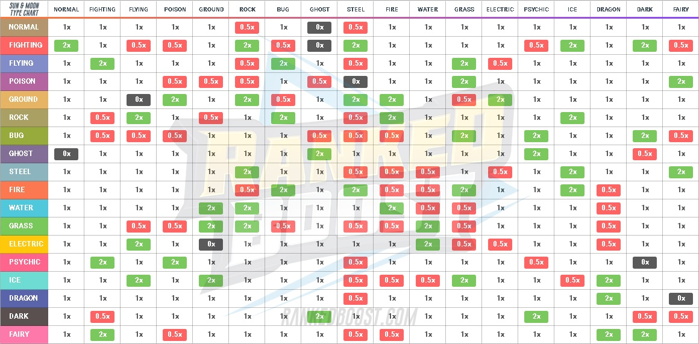
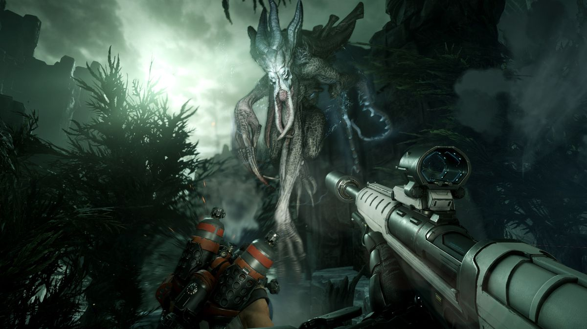

# Maths of game balance and infinite progression

I am [Joel Cabaco Pérez](https://www.linkedin.com/in/joel-cabaco-6074a8160/), student of the
[Bachelor’s Degree in
Video Games by UPC at CITM](https://www.citm.upc.edu/ing/estudis/graus-videojocs). This content is generated for the second year’s
subject Project 2, under supervision of lecturer
[Ricard Pillosu](https://es.linkedin.com/in/ricardpillosu).

In this web page I'm going to explain the concept of game balance and give information on the topic in order to make not only more enjoyable games, but also to make them adapt to our vision of the project and our game pillars.

## What is game balance?

Game balance is the process where developers modify the numbers of the system of the game in order to fit a specific purpose. When a game is perfectly balanced, all of the participants in the game have exactly the same resources at hand, and the game is equally fair. An example of a perfectly balanced game, which are called _symmetric games_, would be Pong, because if both players have the exact same level of skill, each of them will have equal chances of winning. Games like Chess may seem to be symmetric, but in fact they are not, because whoever goes first will have an advantage over the other player. A way to balance these games would be what Go does; adding a certain number of points (in most rules, between 5 and 7) to the player with the white stones. This is because through calculations that we will further see in this topic, the first move advantage of the player with black stones is usually equal to those 5 to 7 points.

## Common terms and concepts

When talking about game balance, we will be using some specific, technical terms to refer to game properties, and talk about complex subjects.

### Determinism

Determinism refers to which kind of results can we expect from each move in the game. A _deterministic_ game would be one where any possible move always has the same result, there is not any kind of randomness involved on its execution, like Chess or Space Invaders, where enemies follow always the same pattern. On the other hand, _non-deterministic_ games will be affected by a roll of a random number in order to determine a result. Examples of non-deterministic games would be Parchís, where every move you do is affected by a dice roll, or Pokémon, which has many mechanics that rely on chances (an electric move with a 30% chance of paralyzing, an attack with a 15% critical hit chance...). A fast way to check if a game is or not deterministic is if, by having the game in its initial state, and being told every move that has been made in a match, you can recreate the exact same game state that match is right now. When that happens, a game is entirely deterministic.

### Transitive and intransitive games

A game's transitivity is determined by the "value" each possible option has. The game is intransitive if all of the options are equally valuable, that is, that they have all the same chance of winning. In Rock, Paper, Scissors, we can calculate if the game is intransitive by computing the amount of possible outcomes that each move has. Rock can tie against rock (0), win againts scissors (+1) or lose against paper (-1). By adding 0+1-1 we get 0. The same goes for paper and scissors. The value of each option is exactly the same, so we can say that the game is intransitive.

### Solution

The solution of a game is the best action that can be taken in order to win it. This is only possible in deterministic games. In videogames, having a solution for our game is usually a non-desired trait, because it creates a big imbalance: players who know the solution will always win, and if both players know it, the game will either tie or be decided on who had the first move. Checkers is a game where this happens many times. You may find that in order to have a game of checkers result in the most optimal outcome for you, there are moves that should be avoided whilst other moves should be prioritised. What these moves are depends on the current arrangement of the checkers on the board, so it's not the solution of the game, but the solution to that game state. Checkers, as Go or Chess, have _theoretical complete solvability_, which means that they could eventually be solved but the number of possible permutations makes it impossible to calculate, by humans nor by current-day computers (or even the ones in near future, at the current exponential growth of computer power).

### Randomness

The term of randomness is really deep and has many subjects to study and take into account, but I will explain what is most useful to us as designers. The element of randomness comes from when board games were adapted into videogames, and they have been kept as a powerful tool that we can use to modify our games' system. Every random element in a game can be seen as a dice roll. Dice rolls give an almost completely random number (assuming all the faces are even) depending on the faces it has. The more faces, the wider the range of randomness is. Dice rolls are notated as xdy + z, where x is the number of die rolled, y is the faces of said die and z a value that is kept constant. So, for example, 1d20 + 5 would give a random value between 6 and 25, and 2d8 + 2 would give a value between 4 and 18. However, as we'll see in just a moment, consecutive dice rolls tend to be less random, so rolling 1d12 would give a more random result than rolling 2d6.

Dice rolls were later adapted into percentage probabilities. These are what is most common nowadays as probability notation, and are much easier to manipulate. We can say that an event has a 25% probabilty to happen, instead of saying that it happens when we roll a 1 in a 1d4 roll.

#### Gaussian Bells and how to handle randomness

A Gaussian Bell, or a Gaussian function, is a mathematical function that represents the amount of time a result has happened, and has a bell curve shape. What this function shows is that by having a random or pseudorandom system, we can predict the results that are going to happen more times. While the first results may seem completely random, eventually we will see that the values tend to group around a center. For a simpler explanation, if we throw 1d6 enough times, we will get more 3s and 4s that any other number. This is because the larger the number of rolls, the more the average of results will tend to the average of possible values. So, if we want to treat a random value in our game as a determined one, we can make the arithmetic average of all the possible values (or just the lower and upper one if we are working with a number interval), and use that value instead. If a player can earn between 6 and 10 HP when leveling up, we will treat that value as 8. If the random element is an event that is bound to happen randomly, such as a critical hit, we can assume that the probability is the amount of times it will happen. For a 25% crit chance, we will count 1 attack from every 4 as a crit.

<iframe width="560" height="315" src="https://www.youtube.com/embed/AUSKTk9ENzg" frameborder="0" allowfullscreen></iframe>

#### Computer generated randomness, seeds, and how to save

Computers are deterministic machines. What I mean is that they are entities that convert some numbers into others, they have lots of 1s and 0s and convert them into other 1s and 0s. There is no way for them to generate a random, indetermined number, so how they handle this is by taking numbers from really erratic mathematic functions, which is not random but works. We call this a form of pseudorandomness, just like a shuffle of cards or a roulette spin or a dice roll: it's not entirely random, but it's close enough to be considered it. But which results from that function do they take, and in what order? This is where seeds come into play. A seed is the number that the sequence starts in, and then the function will keep on taking values using its formula. We usually make that seed be a value that is highly unlikely to be duplicated, like the milliseconds since midnight or the time since the app was started. So, if you play a game and by chance you get the same seed in two matches or game sessions, every random number will give the same result. Of course, the time you take a different action that requires a number to be generated, you will de-sync the generation and you will get the numbers that the other game had generated on the last query. How do we deal with this? There is no way to do it right, but there are different options to choose:

- Saving anywhere: Saving a game anywhere means that the player can just save before an important random roll and just keep reloading until the game gives him what he wants. It breaks the game's design, and is a really boring interaction with the game. Of course, if you're OK with that, you can use it.

_Skyrim (Bethesda, 2011) lets the player save at almost any point on the game, except if there are enemies nearby_

- Saving anywhere, keep the seed saved: Doing this will solve the problem of re-rolling, because if the player is going to miss his objective, he will keep missing it because the generated number will be the same. A way around this may be to query another number by doing another random-requiring action, like attacking an enemy when there is critical chance. So, it's not that safe if your player knows what he's doing.

- Save Points: Save points make it so that players may need to load and then go through a long part of game content in order to get a reroll, which may make them discouraged about keeping repeating and rerolling.

_An example of a save point from Final Fantasy VII (Square, 1997). Save points have been the main method of saving from the first Final Fantasy up until FFXIII (with the exception of FFXI)._

- Suspend save/Quicksave: This method consists on deleting the save right after you load, so there is no way to re-roll something. The downside to this is that if the game is not exited properly (the console/computer is turned off, the game crashes...), all progress is lost. To semi-solve this, you can make the player unable to reload a save he just loaded, but not eliminate it from the system memory. Thus, if the game is exited promptly, you can give him the option to reload from the last loaded save, but then again he might turn off the console manually to get his re-rolls.

_In Fire Emblem: Shin Monshō no Nazo/New Mystery of the Emblem (Intelligent Systems, 2010), during battles, you can only suspend the game. This is done for the earlier mentioned purpose, and for players not to be able to rearrange their troops in a better way if they fail initially._

- Limiting saves: Associating saving with an in-game resource, like the ink ribbons in early Resident Evil games. The problem with this is that the player will then save more cautiously, and not always, so if he dies unexpectedly he might have to repeat a long part because there was no way to know that there was danger there. Unless the game tells them, which lowers the challenge by making the player know what to expect.

_A saving typewriter from Resident Evil (Capcom, 1996)_

- No saves: Some games have no saving at all. This can be done in two ways. The first one is what was popular in NES and other third generation consoles, which is to have the player start over from the beginning or use a password. The second one is letting the player go out of the game whenever he wants, and then be in exactly the same spot when the game loads, so he hasn't got the ability to load whichever save. 

_NES and even some SNES games like Star Fox (Argonaut Software/Nintendo EAD, 1993) had no saving features, a system reminiscent of the arcade machines._

_Souls games, like Bloodborne (From Software, 2015), autosave constantly and also when the player exits, and then deletes the save file on load._

## How to balance a game

Game balance is a really complex topic. Usually when we balance a game we try to aim for a middleground between easy, which makes the game boring, or unforgiving, which makes it frustrating. But in that middleground there are many possible ways to go. The mindset that designers will have when balancing a game will depend on diverse factors:

- Setting/feel: Depending on the setting, you may aim for realistic or surrealistic approaches to movement. For example, a game set in World War II will have the player jump like a regular human would, but if you establish your player in, say, outer space, you may want to have a different gravitational force, changing the height and speed of the jump. The feel also takes part in this, because you may have characters that are set in a space where "regular physics" would apply, but for gameplay reasons you modify them so that they end up being less realistic. A good example for this is the difference in mechanics between Fortnite and PUBG.

_The Impulse Grenade fares better in Fortnite than PUBG because the latter aims for realism, so this kind of a mechanic strongly deviates from the intended game feel._

Fighting Games and RTS Games usually are not that affected by this, because the gameplay needs characters to jump, move or attack in very strange and surrealistic ways.

_The 2013 remake of Flashback (Delphine Software Entertainment, 1992) uses a realistic aesthetic but has a surrealist jumping height_

- Target audience: When balancing your game, you will have to take into account what your playerbase will be. Thus, you can set the game's numbers to better fit the experience you want for your players. There are a lot of ways to do this, and we will delve deeper into this later. 

_Dark Souls (From Software, 2011), for instance, is not intended to be played by casual audiences._

- Fairness: It should go without saying that difficulty is the easiest thing to create for a game, but what is truly challenging is to create a good and fair difficulty. The typical terms "you suck at this game" or "git gud" should never be on the designer's mouth when adressing players/testers. The game has to feel good and nice to play. This does not mean to make a game easy, because that can lead to boredom and eventually to your player to stop playing the game. What designers should aim for is to entertain, not to set up impossible challenges so that the game is tagged as "difficult".

### Luck vs Skill

Compare Chess to Parchís. One is purely deterministic, and the other is completely non-deterministic. Chess relies entirely on player skill, so a better player will almost always win, there is not any "luck" component that can lead him to lose. Parchís is a game where players never take any decision, they just roll a dice and move forward. So, we can say that luck makes a game more casual and less skill-based. In board games, this is not a problem, there are many games that rely only on luck and are pretty popular, and this can happen in videogames, but making this kind of a game usually ends up with a game to play for a while and then move on to something else, which is not what we want.

In order to raise the amount of skill required to win in a game, we can substract randomness, and do the opposite to lower it. This varies depending on your target, but most times if you're aiming for competitive, more serious kinds of games, you will need to reduce or nearly eliminate any random element of the game, and if you aim for a game that can be played by new players so that they can sometimes beat veteran ones, luck may be increased. But then again, there are competitive games that rely on luck, and if players are ok with that, there is no problem there.

### Dominant strategies

Something that you should avoid in your game is to have a "dominant strategy", a "best move". For instance, you can have 2 items on a game, one gives you +30 max health, and the other one +30 resistance. If we know that the formula for damage is, say: damage = attack - 0.7 x resistance, we can calculate how much of that resistance fares as "effective" health. In the end, that's what it is, resistance keeps you from being harmed, therefore it's like having more health. For each attack, the damage will be reduced by 21 points, so if the character is attacked twice, your deffense will mitigate 42 damage points. In only two attacks, the better resistance has already given us more effective health than the +30 health item. So, we can confirm that the +30 resistance item is considerably better than the +30 health one, therefore it's the dominant strategy, its the "solution" of this part of the game.

_Kingdom Hearts II has an ability system where some abilities are useless or really situationally better than others (more on situational balance later). This creates the dominant strategy where players will only use the abilities which give a longer combo. In hard/expert mode, though, bosses can only be killed by the last hit of a combo, so the dominant strategy is to use a 1-hit only attack rather than what the normal mode teaches you._

This hurts the gameplay so much because, first of all, a player that knows this will always have an advantage over a newcomer or just someone who doesn't know that, but also making an item much better than the other makes the last one essentially useless, and why would you want to give an option to players if one is clearly better and eventually no one will pick the weaker one? The only case where this can be used is when you want the players to solve a certain part of the game to advance forward or get some loot, for example. You can award them for taking the better choice, as if it was a puzzle.

Now, having dominant strategies is something that is bound to happen, and really hard to avoid if your game system is complex and elaborated. This is why multiplayer games keep releasing patches constantly to balance the game: they tend to have really deep and/or extensive game systems, and checking every possible combination in order to find what could possibly be a dominant strategy would be time consuming. The way to adress this problem is by testing and/or getting feedback from players, or maybe just simply watch them play. In your fighting game, is there any move that players tend to spam, and feels really powerful? Think of a countermeasure to that attack, maybe it can be blocked and its recovery is so long that you can get attacked first, or maybe there is a special move that can counter it. Then, maybe that special move is what gets spammed, so think of a countermeasure to that, too. Eventually, you will have a system with intransitive mechanics: all of the movements have the same (or a really similar) value, because each one has balanced strengths and weaknesses.

_A somewhat balanced mechanic example from Pokémon Sun and Moon (Game Freak, 2016). All types have similar resistances, weaknesses, advantages and disadvantages in relation to other types._

### Situational Balance

As we've seen, there are situations where we may end up having an option that is better than another. But how do we know this if the value of an option changes through time? In the last example about the different items, we know that the 30 resistance item is going to be better than the 30HP one, but only after two attacks, because the damage mitigated by resistance is superior to the health that the other item gives you. But, what if you only get attacked once? What if the resistance is only used against physical damage, while it still makes you vulnerable to magic spells? This is when we enter in situational balance.

Situational balance is, theoretically, really easy to compute. Let's look at an example from the classic tabletop RPG Dungeons and Dragons. When attacking, the character has to roll a d20 to check if their attack hits or misses. The character's Hit Bonus (which depends on weapon type, player stats, etc, and is abbreviated as HB) is added to the roll, so a +3 attack bonus would make the player roll 1d20+3. If this roll outnumbers the target's Armor Class (AC), the attack hits, and the player does the appropriate roll to check the damage. So, +1 in AC will lower the hit chance by 5%, and +1 in HB will increase it by 5% (because we're using a d20, and 100%/20 = 5%). Which one of them is more valuable? Well, the short answer will be "it depends". The long answer will be: if you're outnumbered, HB will be more valuable because you will be needing it to fight more enemies. If you're in a party, and there is only one enemy, lowering its AC will make it more vulnerable to hits by you and your companions. If you're on a 1 versus 1 battle, both options are equally valuable. So going back to how to compute situational balance, we can take into account the situation that is most likely on our game, and balance the mechanic that way. 

As a game designer, we can take profit of this. If you D&D campaign has the players fight large numbers of enemies, raising HB will be more useful than lowering AC, so you should reward players accordingly depending on the challenge you want them to overcome. Want to make the game hard? Raise the cost of an extra HB. Want to make them feel powerful and not frustrated by misses? Make HB really easy to obtain.

In some cases, we can even give numerical values to the benefits that an option has, and balance the game accordingly. For example, the fire element in a game is strong against 30% of the enemies, and deals regular damage to the other 70%. Assume the average numerical value for an element is 100, and that being strong against an enemy doubles the damage. By calculating: 70 x 1 + 30 * 2, we get that the fire element has a value of 130. Let's say that now, 30% of enemies are resistant to fire, receiving only half of the damage. Then we could calculate 40 x 1 + 30 x 2 + 30 x 0.5, and get that the value of that element is 115. In this case, the enemy percentage that is weak to fire is the same as the one for enemies that resist it, but the value is still higher than the average. Why is this? This happens because the bonus damage we get by a 2x multiplier is higher than the reduced damage from a 0.5x multiplier. We can leave it as this, or make the bonus against a weak enemy 1.5x instead of 2x. If the player and the enemy use fire attacks about the same amount of times, leaving it 2x will make the game balanced in that aspect. On the other hand, if the player gets to attack with fire more times, the 2x multiplier will make him more powerful the enemy and have an advantage, and the other way around if enemies attack with fire more times than the players, because the attacking side will have the advantage. Reducing the bonus to 1.5x will make it equally balanced for both sides no matter who the attacking side is.

However, there are times where we don't want both sides to be equally powered, and that's where perfect imbalance gets into play.

_Evolve (Turtle Rock Studios, 2015), has 4 players playing as soldiers with the objective to kill a fifth player, which controls a much more powerful, giant monster_

Here is a video from ExtraCredits that explains the topic really well.

<iframe width="560" height="315" src="https://www.youtube.com/watch?v=e31OSVZF77w" frameborder="0" allowfullscreen></iframe>

----------
